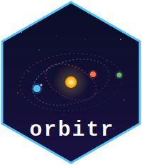
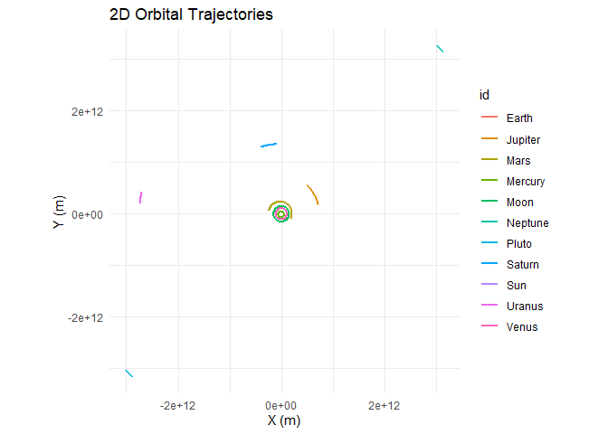
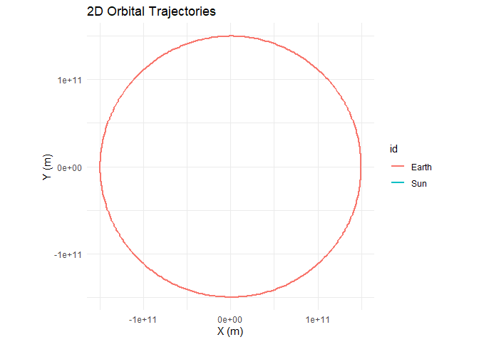
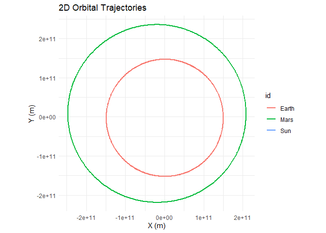
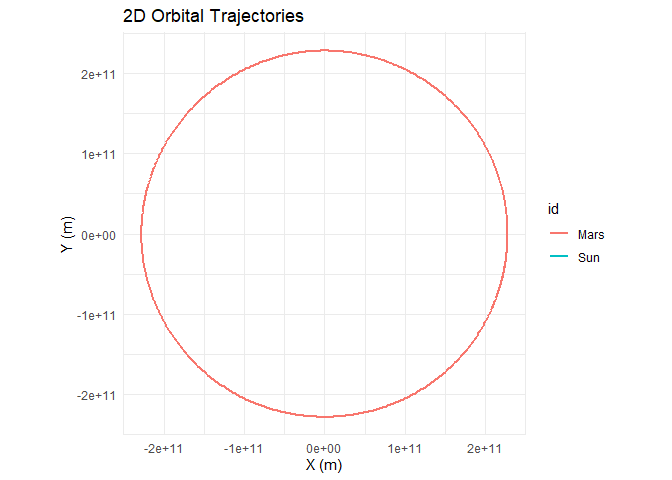
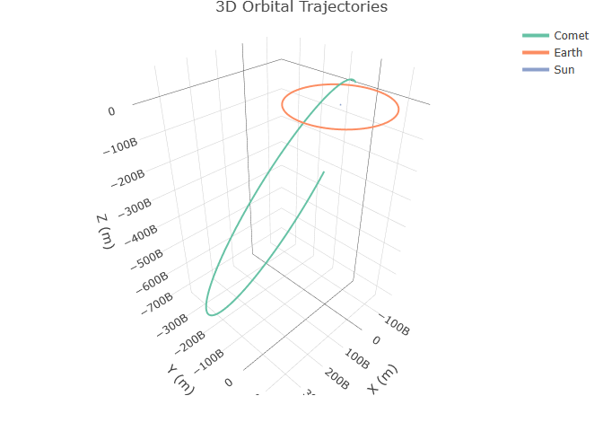

# orbitr 

**Tidy N-body orbital mechanics for R.**

> **Early beta** — `orbitr` is functional and the physics engine is
> stable, but this is an early release. Function names, defaults, and
> behavior may change between versions. Feedback, bug reports, and
> contributions are welcome on
> [GitHub](https://github.com/DRosenman/orbitr).

> Full documentation, examples, and guides at
> **[orbit-r.com](https://orbit-r.com/)**

## Installation

``` r
# Development version from GitHub:
# install.packages("devtools")
devtools::install_github("DRosenman/orbitr")
```

## The Full Solar System in Two Lines

``` r
library(orbitr)

load_solar_system() |>
  simulate_system(time_step = seconds_per_day, duration = seconds_per_year) |>
  plot_orbits(three_d = FALSE)
```

<!-- -->

`load_solar_system()` builds the Sun, all eight planets, the Moon, and
Pluto with real orbital data from JPL — eccentricities, inclinations,
and all. One line to build it, one line to simulate and plot.

## Four Lines to an Orbit

``` r
library(orbitr)

sim <- create_system() |>
  add_sun() |>
  add_body("Earth", mass = mass_earth, x = distance_earth_sun, vy = speed_earth) |>
  simulate_system(time_step = seconds_per_day, duration = seconds_per_year)

sim |> plot_orbits()
```

<!-- -->

Built-in constants like `mass_sun`, `distance_earth_sun`, and
`speed_earth` are real-world values in SI units — no Googling needed.
`simulate_system()` returns a tidy tibble, ready for `dplyr`, `ggplot2`,
`plotly`, or anything else.

### Animated

``` r
animate_system(sim, fps = 15, duration = 5)
```

<!-- -->

## More Examples

### Build Your Own System with `add_planet()`

Pick and choose real solar system bodies without looking up any numbers:

``` r
create_system() |>
  add_sun() |>
  add_planet("Earth", parent = "Sun") |>
  add_planet("Mars",  parent = "Sun") |>
  simulate_system(time_step = seconds_per_day, duration = seconds_per_year * 2) |>
  plot_orbits(three_d = FALSE)
```

<!-- -->

Every planet’s mass, eccentricity, inclination, and orbital orientation
are filled in from JPL data. Override any element to explore “what if”
scenarios:

``` r
# What if Mars had a perfectly circular orbit?
create_system() |>
  add_sun() |>
  add_planet("Mars", parent = "Sun", e = 0) |>
  simulate_system(time_step = seconds_per_day, duration = seconds_per_year * 2) |>
  plot_orbits(three_d = FALSE)
```

<!-- -->

### Earth-Moon

``` r
create_system() |>
  add_body("Earth", mass = mass_earth) |>
  add_planet("Moon", parent = "Earth") |>
  simulate_system(time_step = seconds_per_hour, duration = seconds_per_day * 28) |>
  plot_orbits()
```

<!-- -->

### Keplerian Orbital Elements

For full control, `add_body_keplerian()` lets you specify orbits using
classical elements — semi-major axis, eccentricity, inclination, and
orientation angles — instead of raw positions and velocities:

``` r
# A comet on a highly eccentric, tilted orbit
create_system() |>
  add_sun() |>
  add_planet("Earth", parent = "Sun") |>
  add_body_keplerian(
    "Comet", mass = 1e13, parent = "Sun",
    a = 3 * distance_earth_sun, e = 0.85,
    i = 60, lan = 45, arg_pe = 90, nu = 0
  ) |>
  simulate_system(time_step = seconds_per_hour, duration = seconds_per_year * 5) |>
  plot_orbits()
```

<!-- -->

### Kepler-16: A Real Circumbinary Planet

Kepler-16b orbits two stars — a real-life Tatooine.

``` r
G  <- gravitational_constant
AU <- distance_earth_sun

m_A <- 0.68 * mass_sun
m_B <- 0.20 * mass_sun
a_bin <- 0.22 * AU

r_A <- a_bin * m_B / (m_A + m_B)
r_B <- a_bin * m_A / (m_A + m_B)
v_A <- sqrt(G * m_B^2 / ((m_A + m_B) * a_bin))
v_B <- sqrt(G * m_A^2 / ((m_A + m_B) * a_bin))

r_planet <- 0.7048 * AU
v_planet <- sqrt(G * (m_A + m_B) / r_planet)

create_system() |>
  add_body("Star A",      mass = m_A,                 x = r_A,      vy = v_A) |>
  add_body("Star B",      mass = m_B,                 x = -r_B,     vy = -v_B) |>
  add_body("Kepler-16b",  mass = 0.333 * mass_jupiter, x = r_planet, vy = v_planet) |>
  simulate_system(time_step = seconds_per_hour, duration = seconds_per_day * 228.8 * 3) |>
  plot_orbits()
```

<!-- -->

## Features

- **Tidy output** — one row per body per time step, works with the whole
  tidyverse
- **Real solar system data** — `load_solar_system()` and `add_planet()`
  use JPL orbital elements, no manual setup needed
- **Keplerian elements** — `add_body_keplerian()` lets you define orbits
  with semi-major axis, eccentricity, inclination, and orientation
  angles
- **Built-in constants** — masses, distances, and speeds for the Sun,
  all eight planets, and the Moon
- **C++ engine** — compiled via Rcpp with automatic fallback to
  vectorized R
- **Three integrators** — Velocity Verlet (default), Euler-Cromer, and
  standard Euler
- **2D and 3D** — `plot_orbits()` auto-dispatches to interactive plotly
  when any body has Z-axis motion; force either with
  `three_d = TRUE/FALSE`
- **Animations** — `animate_system()` renders GIFs with fading trails
  via gganimate
- **Reference frames** — `shift_reference_frame("Earth")` re-centers
  everything on any body

## Learn More

- **[Get Started](https://orbit-r.com/articles/quick-start.html)** —
  full walkthrough
- **[Building Two-Body
  Orbits](https://orbit-r.com/articles/building-two-body-orbits.html)**
  — choosing positions, velocities, and masses
- **[Keplerian Orbital
  Elements](https://orbit-r.com/articles/keplerian-elements.html)** —
  the physics behind `add_body_keplerian()` and `add_planet()`
- **[Examples](https://orbit-r.com/articles/examples.html)** —
  Earth-Moon, Sun-Earth-Moon, Kepler-16, and more
- **[The Physics](https://orbit-r.com/articles/the-physics.html)** —
  integrators, softening, and the C++ engine
- **[Custom
  Visualization](https://orbit-r.com/articles/custom-visualization.html)**
  — build your own plots with ggplot2 and plotly
- **[API Reference](https://orbit-r.com/reference/index.html)** — full
  function documentation
- **[Interactive Demo](https://daverosenman.shinyapps.io/orbitr/)** —
  try orbitr in your browser with the Shiny app

## Acknowledgments & Further Reading

The physics and numerics in `orbitr` were informed by *Classical
Dynamics of Particles and Systems* by Thornton & Marion, *Computational
Physics* by Mark Newman, and *Data Structures & Algorithms in Python* by
Canning, Broder & Lafore. The C++ engine was built with help from the
official [Rcpp documentation on
CRAN](https://cran.r-project.org/package=Rcpp). See the full [Further
Reading](https://orbit-r.com/articles/further-reading.html) article for
details on how each resource was used.

Shoutout to The College of New Jersey, where I first got hooked on this
stuff. Go Lions.

## License

MIT
